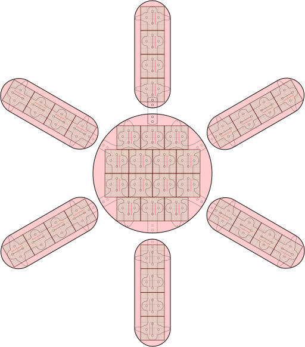

<!--lint disable list-item-indent-->

# LEDBoard Layout 'Sun'
'Sun' build with [LEDBoard 4x4 16bit](https://github.com/s-light/LEDBoard_4x4_16bit)

## arduino test sketch
have a look at [sw/LEDBoard_HWTest_Sun](sw/LEDBoard_HWTest_Sun/readme.md)
how to setup an arduino board to do basic testings for the completed sun.

## control software
to control the sun / display content i have chosen to separate
this in two parts:

First i use an Arietta embedded linux board as
Network (Art-Net and E1.31 / sACN) two SPI/TLC5971 converter.
Additionally this should get basic 'playback' capabilities.
Something like  
`automatically start a rainbow loop on system-startup`  
--> for this task every embedded board should fit that has a free native SPI output
and can run debian based linux (for example Raspberry Pi) -
for ease of use i use the OLA software to create the Network-SPI bridge.
(currently there is a fork where i develop the [TLC5971 functionality](https://github.com/s-light/ola/tree/SPI_TLC5971_new))

Second there will be 'some Application' of some form running on an power-full
computer to generate the Data.
Ideas:
- [processing](https://processing.org/)
- [openFrameworks (OF)](http://openframeworks.cc/)
- [Pure Data (pd)](http://puredata.info/)

SW is a big TODO :-)

## mounting sun
in [mounting_sun.md](mounting_sun.md) are all information
regarding the Hardware / frame to build the sun.

---
# License
all Software in this repository is license under MIT License (see [LICENSE file](LICENSE))

all HW / Design files are licensed as CC-BY

<!-- License info -->
 

    LEDBoard_Layout_Sun

by
<a xmlns:cc="http://creativecommons.org/ns#" href="https://github.com/s-light/LEDBoard_Layout_Sun" property="cc:attributionName" rel="cc:attributionURL">
    Stefan Krüger (s-light)
</a>
is licensed under a
<a rel="license" href="http://creativecommons.org/licenses/by/4.0/">
    Creative Commons Attribution 4.0 International License
</a>.
