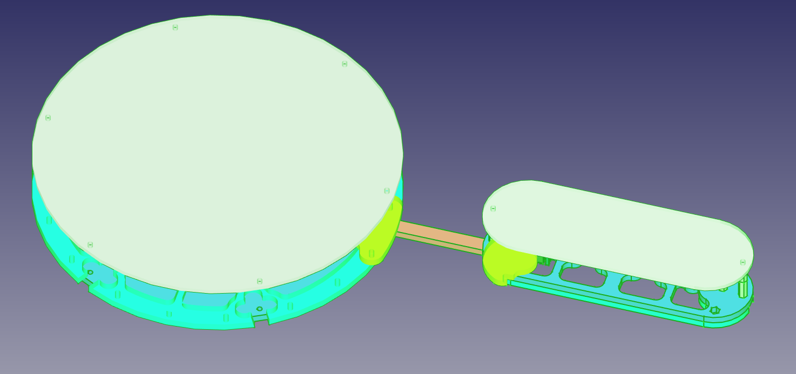

<!--lint disable list-item-indent-->

# Mounting Sun

full design: [mounting_sun.step](mounting_sun.step)

this is now version 2 - a redesign - this time made in FreeCAD v0.17 (daily) completely in 3d.

## parts-list

### laser-cutting
- Pine-Plywood (>=4mm thickness)
  - 6x [arm/arm_base.svg](arm/arm_base.svg)
  - 2x6x [arm/arm_socket.svg](arm/arm_socket.svg)
  - 12x [arm/arm_lock.svg](arm/arm_lock.svg)
  - 2x6x [connector/socket_connector_40mm.svg](connector/socket_connector_40mm.svg)
  - 6x [center/center_lock.svg](center/center_lock.svg)
  - 1x [center/center_base.svg](center/center_base.svg)
  - 1x [center/center_socket.svg](center/center_socket.svg)
  - 1x [center/center_socket2.svg](center/center_socket2.svg)
- [Plexiglas WH02 (3mm)](https://www.plexiglas-shop.com/DE/de/einseitig-satiniert-d3k0ydk22v3/plexiglas-satinice-weiss-wh02-sc-1jmuadz2jyj~p.html?know=search%3AWH02)
  - 6x [arm/arm_diffusor.svg](arm/arm_diffusor.svg)
  - 1x [center/center_diffusor.svg](center/center_diffusor.svg)

### screws for LEDBoard mounting:
TODO: recalculate screws...
- 38*2*2 (=152)x [cylinder head - screw M3x10mm](https://www.wegertseder.com/ArticleDetails.aspx?ANR=2588-412)
- 38*2 (=76) [spacer M3x15mm](https://www.reichelt.de/index.html?ARTICLE=7120&GROUPID=7758&artnr=DI+15MM)

### screws for wood connections:
- 6*3 (=18)x [countersunk - screw M3x20mm](https://www.wegertseder.com/ArticleDetails.aspx?ANR=2606-242)
- 6*3 (=18)x [bolt M3](https://www.wegertseder.com/ArticleDetails.aspx?AKNUM=3991)

### cable

TODO:
for LEDBoard interconnections see 
cable type: 0,8mm solid copper conductor --> has to tightly fit in the LEDBoard sockets

#### power
- 2* 2m for main supply [4mm² Loudspeaker wire](https://www.reichelt.de/index.html?ARTICLE=9887&GROUPID=5034&artnr=LAT+400-5)
- 6* 350mm for arm supply [0.5mm² Loudspeaker wire](https://www.reichelt.de/index.html?ARTICLE=74777&GROUPID=5034&artnr=LAW+205-10)

### Power Supply
TODO
