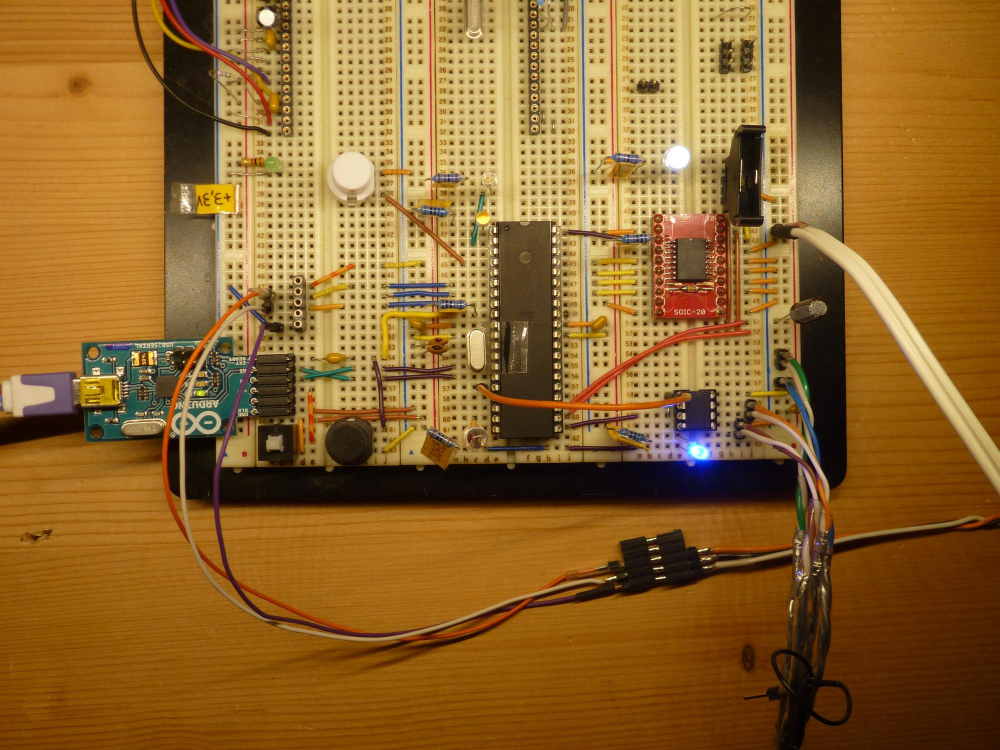

<!--lint disable list-item-indent-->

# LEDBoard_HWTest_Sun

You need an Arduino compatible micro controller with a good amount of RAM.
i successfully tested an ATmega1284.
(32U4 is to small.)

This sketch has some Test-Patterns that use the full board-count of the sun.
One problem is the update rate.
as an simple  for loop to set all channels individually takes 36ms -
there is an additional 1ms to write data out to the tlc chips.

the sketch receives 5 channels of DMX from an external controller.
this setup is done so you can control this with with the
[LSM303_to_DMX](https://github.com/s-light/LSM303_to_DMX) Sketch.

the DMX receiving has some glitches and sometimes generates wrong values.
this only happens when the rendering/update process is active: `sequencer_mode != sequencer_OFF`
so seems there is some timing or interference problems in the thing...

the external control is active in only some of the sequence modes.
mainly in `sequencer_SPIRAL`:
- heading of the LSM303 controls the color (Hue),
- Y-Axis controls `sequencer_interval` mapped as 100-2000ms

